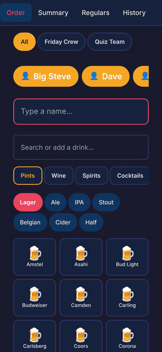
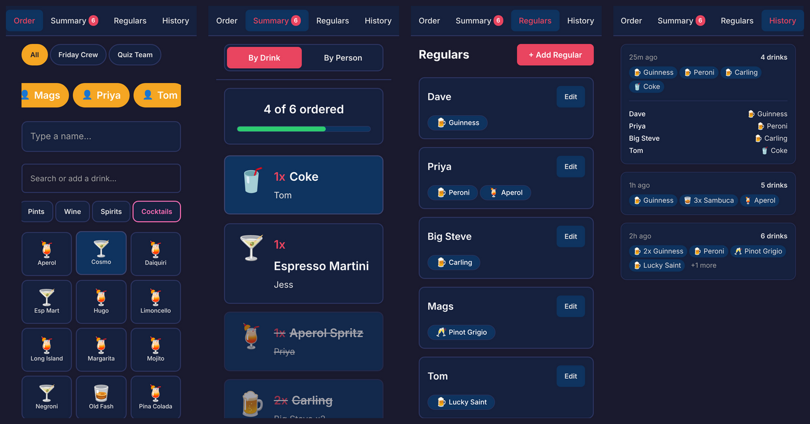
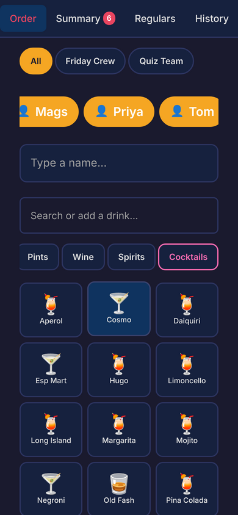
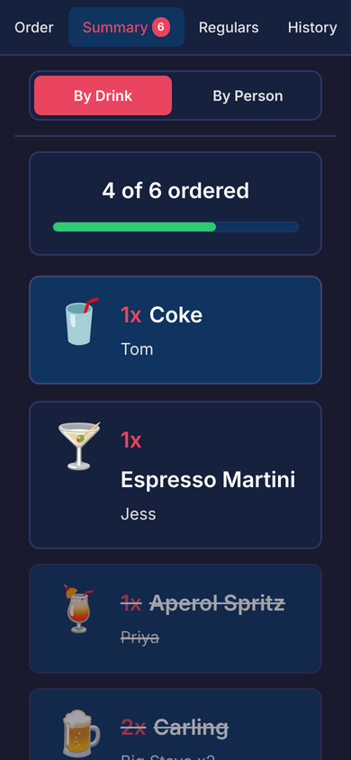
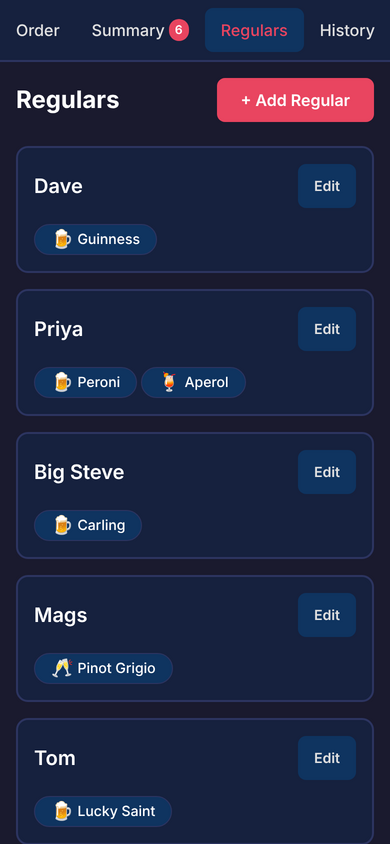
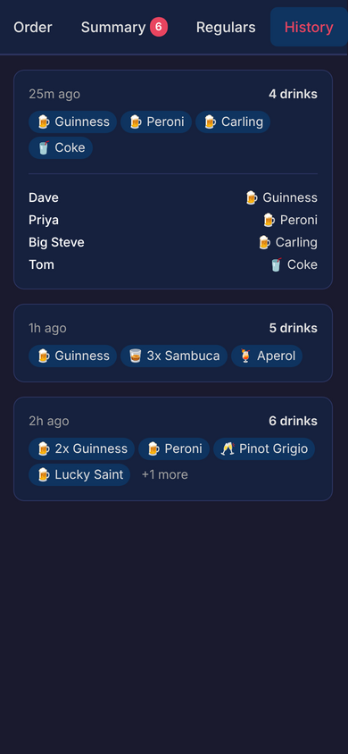

<div align="center">

# 🍺 My Round

### *"Right, what's everyone having?"*

**The pub round, sorted. In about four taps.**

[](https://myround.netlify.app)
[](https://myround.netlify.app)
[](LICENSE)



</div>

---

## 🎯 The Problem

It's your round. Seven people. Someone says "same again". Someone else changes their mind halfway through. Dave wants "the dark one, not Guinness, the other one". Somebody's on the zeros tonight. You get to the bar, the barperson looks up expectantly, and your brain has turned to mush.

**My Round fixes that.** Tap names, tap drinks, walk to the bar, read it off. Tick each one as it's poured. Done. Back to your seat before the head settles.

---

## ✨ What it does

| | |
|---|---|
| 👤 **Regulars** | Save your mates and their usual. One tap on *Dave* adds his Guinness. Got more than one usual? You get a quick pick. |
| 👥 **Groups** | *Friday Crew*, *Quiz Team*, *Work Lot*. Filter the regulars bar to whoever's actually turned up. |
| 🔁 **Same again?** | Type a name and My Round remembers what they had last time. One tap and it's in. |
| 🔍 **Search or add** | 160+ UK pub drinks across Pints, Wine, Spirits, Cocktails, Soft, Shots and 0%. Not on the list? Type it and it's saved for next time. |
| 🧾 **Bar summary** | Grouped **by drink** ("3x Carling") for ordering, or **by person** for handing out. Tap to tick off as they're poured, with a progress bar so you know where you are. |
| ↩️ **Undo** | Hit *Done* by mistake? You've got 10 seconds to take it back. |
| 📜 **History** | Your last rounds, with who had what. |
| 💾 **Backup** | Export everything to JSON and import it on a new phone. |
| 📱 **Installable PWA** | Add to home screen. Works offline, which matters in the back room with one bar of signal. |

---

## 📸 Screens

<div align="center">

</div>

<table>
<tr>
<td align="center" width="25%"><br/><b>Order</b><br/><sub>Tap a regular or type a name, then tap a drink</sub></td>
<td align="center" width="25%"><br/><b>Summary</b><br/><sub>Read it to the bar, tick as it's poured</sub></td>
<td align="center" width="25%"><br/><b>Regulars</b><br/><sub>Your crew and their usuals</sub></td>
<td align="center" width="25%"><br/><b>History</b><br/><sub>Who had what, and when</sub></td>
</tr>
</table>

---

## 📖 A Short History of the Round

> *"Mine's a pint."*

Buying in rounds is one of the oldest unwritten rules in British and Irish drinking. There's no law that says you have to, but skip yours and people will remember.

**🏛️ From tavern to public house.** Britain's pubs go back a long way. The Romans brought the *taberna*, roadside places selling wine, and the Anglo-Saxons had alehouses, often just someone's front room with an ale-stake hung outside to show a fresh brew was on. In **1393** Richard II made it law that alehouses had to display a sign so the official ale-taster could find them. That's where the painted pub sign comes from, and the *Red Lions*, *Crowns* and *White Harts* still hanging today.

**🤝 Standing your round.** Exactly when "treating" turned into the rotating round isn't recorded anywhere, but by the 19th century it was firmly part of pub life. The rules are simple: everyone in the group buys for everyone else in turn. It's partly about fairness, partly about friendship, and mostly about not being the one who slopes off to the loo when it's their go. In *Watching the English* (2004), the anthropologist Kate Fox describes round-buying as a ritual of reciprocity, a way of keeping things equal between friends without anyone having to mention money.

**🚫 The time they banned it.** In **1915**, during the First World War, the government worried that drink was slowing down munitions production. Under the Defence of the Realm Act, the **"No Treating" order** made it an offence in many areas to buy a drink for anyone else. Rounds were outlawed. People were fined for buying a pint for a friend. Lloyd George famously said Britain was fighting *"Germany, Austria and Drink"*, and that drink was the worst of the three. (The round survived anyway. It always does.)

**🍺 The pint.** The imperial pint, **568 ml**, was standardised by the Weights and Measures Act of 1824 and has outlasted almost everything else in imperial measurement. When the UK went metric, draught beer and cider kept their pints. You can't order "half a litre of bitter" in a British pub without getting a look.

**📱 And now.** Two hundred years on, the round still works the same way: one person, a list of drinks, and a memory that gets worse as the evening goes on. My Round helps with that last bit.

---

## 🍻 Round Etiquette (as enforced by nobody)

1. **Know your order before you're asked.** "Erm, what have they got?" gets the group tutting.
2. **Same again means same again.** No upgrading to a double on someone else's round.
3. **Don't leave before your round.** Everyone notices.
4. **Zeros count.** A Lucky Saint is a full member of the round. My Round has a whole 0% tab.
5. **Tick it off.** That's what the Summary screen is for.

---

## 🛠️ Under the Bonnet

<div align="center">


</div>

- **Vite + React + TypeScript.** Fast to build, fast to load.
- **react-router-dom** for the Order / Summary / Regulars / History / Settings screens.
- **vite-plugin-pwa + Workbox** for the service worker, offline support and update prompts.
- **localStorage only.** No accounts, no server, no tracking. Your round stays on your phone.
- **Designed for the bar.** Big touch targets for one-handed use, a dark theme that's readable in a dim pub, and haptic feedback on every tap.

```
src/
├── components/   # DrinkGrid, NameInput, RegularsPicker, SummaryView, ...
├── pages/        # Round, Summary, Regulars, History, Settings
├── hooks/        # useRound, useRegulars (context + persistence), useFocusTrap
├── data/         # The drinks database 🍺🍷🥃🍸
└── lib/          # storage, haptics, utils
```

---

## 🚀 Pull Up a Stool (Local Dev)

```bash
git clone https://github.com/ChrisBrooksbank/myround.git
cd myround
npm install
npm run dev        # Start the dev server
npm run build      # Production build
npm run preview    # Preview the production build
npm run lint       # ESLint
```

## 🌍 Deployment

Deployed on **Netlify** via `netlify.toml`, and auto-deploys from `main`. Every merge goes straight to the live app.

---

<div align="center">

**Made for everyone who's ever stood at a bar trying to remember what Dave wanted.**

🍺 Cheers! 🍺

[MIT License](LICENSE) · [myround.netlify.app](https://myround.netlify.app)

<sub>Please drink responsibly. My Round can help you keep count of the round, but not of how many you've had.</sub>

</div>
